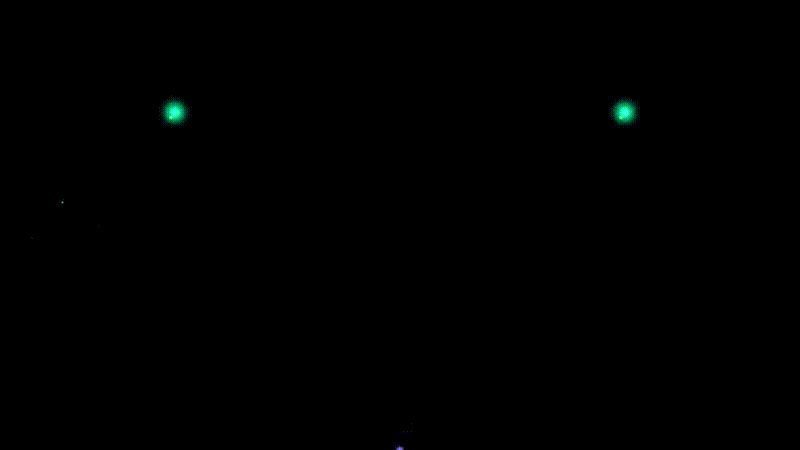

# EffekseerForYMM4

EffekseerのエフェクトをゆっくりMovieMaker4（YMM4）で再生するためのプラグインです。

  

## インストール方法

1. [GitHub Releases](https://github.com/takoyakisoft/EffekseerForYMM4/releases)から最新の`EffekseerForYMM4.zip`をダウンロードします。
2. `YukkuriMovieMaker4/user/plugin`フォルダ内に、ダウンロードしたファイルをそのまま解凍します。

## 使い方

1. 映像エフェクトに「Effekseerビデオエフェクト」が追加されます。
2. 音声エフェクトに「Effekseer音声エフェクト」が追加されます。
3. エフェクトファイル（.efkefc, .efk）を選択して再生します。

### エフェクトファイルの入手と作成

エフェクトファイル（.efkefc, .efk）は、Effekseerツールを使用して作成・編集できます。
以下のリンクからツールをダウンロードし、同梱されている`Sample`フォルダ内のエフェクトを使用するか、ご自身で作成してください。

[Effekseer 1.7.3.0 (Windows版)](https://github.com/effekseer/Effekseer/releases/download/1.7.3.0/Effekseer1.7.3.0Win.zip)

**注意：**
`.efkproj` はEffekseerのプロジェクトファイルであり、直接読み込むことはできません。
Effekseerでファイルを開き、メニューの「ファイル」>「エクスポート」>「標準形式」でEffekseerファイル(\_.efk)を選択して保存してください。
この際、**保存先は必ず`.efkproj`と同じフォルダにしてください**。別の場所に保存すると、テクスチャや音声ファイルへの相対パスが参照できなくなり、正しく表示・再生されません。

## 動作環境

- YukkuriMovieMaker4 v4.49.0.2
- Windows 11 (64bit)

## ライセンス

このソフトウェアはMITライセンスの下で公開されています。

### 使用ライブラリ

- **Effekseer** (v1.7.3.0) - MIT License
- **YukkuriMovieMaker4** (v4.49.0.2)
