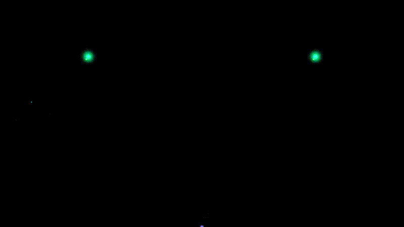

# EffekseerForYMM4

EffekseerのエフェクトをゆっくりMovieMaker4（YMM4）で再生するためのプラグインです。

  

## インストール方法

1. [GitHub Releases](https://github.com/takoyakisoft/EffekseerForYMM4/releases)から最新の`EffekseerForYMM4.zip`をダウンロードします。
2. `YukkuriMovieMaker4/user/plugin`フォルダ内に、ダウンロードしたファイルをそのまま解凍します。

## 使い方

1. 映像エフェクトに「Effekseerビデオエフェクト」が追加されます。
2. 音声エフェクトに「Effekseer音声エフェクト」が追加されます。
3. エフェクトファイル（.efkefc, .efk）を選択して再生します。

### エフェクトファイルの入手と作成

エフェクトファイル（.efkefc, .efk）は、Effekseerツールを使用して作成・編集できます。
以下のリンクからツールをダウンロードし、同梱されている`Sample`フォルダ内のエフェクトを使用するか、ご自身で作成してください。

[Effekseer 1.7.3.0 (Windows版)](https://github.com/effekseer/Effekseer/releases/download/1.7.3.0/Effekseer1.7.3.0Win.zip)

**注意：**
`.efkproj` はEffekseerのプロジェクトファイルであり、直接読み込むことはできません。
Effekseerでファイルを開き、メニューの「ファイル」>「エクスポート」>「標準形式」でEffekseerファイル(\_.efk)を選択して保存してください。
この際、**保存先は必ず`.efkproj`と同じフォルダにしてください**。別の場所に保存すると、テクスチャや音声ファイルへの相対パスが参照できなくなり、正しく表示・再生されません。

## 動作環境

- YukkuriMovieMaker4 v4.49.0.2
- Windows 11 (64bit)

## 開発者向け

### ソリューション構成

- `EffekseerNativeCore`
  - 純粋ネイティブC++の静的ライブラリです。
  - Effekseer本体とネイティブ実装をビルドします。
- `EffekseerForNative`
  - C++/CLI の薄いブリッジです。
  - `EffekseerNativeCore` を参照し、C# 側から利用するDLLを生成します。
- `EffekseerForYMM4`
  - YMM4 プラグイン本体です。
  - UI、ローカライズ、ファイルコピー、ネイティブDLL展開を担当します。
- `YukkuriMovieMaker.Generator`
  - 翻訳CSVから `resx` とクラスを生成するソースジェネレーターです。

### 開発時に必要なプロジェクト

通常の開発・ビルドで必要なのは以下です。

- `EffekseerNativeCore`
- `EffekseerForNative`
- `EffekseerForYMM4`
- `YukkuriMovieMaker.Generator`

`EffekseerForYMM4.Tests` は必要なときだけビルドすれば十分です。

### ビルド構成

- 通常は `Debug|x64` を使用します。
- 配布物の確認や GitHub Actions と同じ条件での確認は `Release|x64` を使用します。
- このリポジトリでは実行対象を `x64` に固定しています。

### 配布用ファイルについて

- 翻訳ファイルはビルド時に `ar-sa`, `en-us`, `es-es`, `id-id`, `ko-kr`, `zh-cn`, `zh-tw` の `EffekseerForYMM4.resources.dll` として出力されます。
- ネイティブDLLはプラグインフォルダ直下に置かず、`nativepayload` 配下に `EffekseerForNative.bin` と `Ijwhost.bin` として配置されます。
- 実行時に `EffekseerForYMM4` が `%LocalAppData%\YukkuriMovieMaker\PluginCache\EffekseerForYMM4` へ上書き展開して読み込みます。

### ビルド前提

- `Directory.Build.props` に `YMM4DirPath` を設定すると、ビルド後に YMM4 の `user/plugin/EffekseerForYMM4` へ自動コピーされます。
- GitHub Actions の release ビルドは `Release|x64` のみを使用します。

## ライセンス

このソフトウェアはMITライセンスの下で公開されています。

### 使用ライブラリ

- **Effekseer** (v1.7.3.0) - MIT License
- **YukkuriMovieMaker4** (v4.49.0.2)
