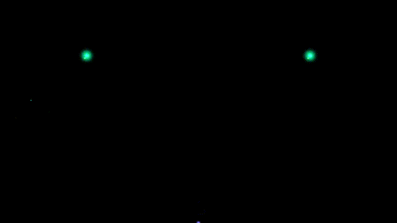

# EffekseerForYMM4

[](https://github.com/takoyakisoft/EffekseerForYMM4/actions/workflows/build.yml)
[](#)
[](#)


Effekseerで作成したエフェクトを、ゆっくりMovieMaker4（YMM4）で再生し、映像に合成するためのプラグインです。

<p align="center">
  
</p>

## v1.2.0 の主な変更

- GitHub Releasesに加え、BOOTH向けの配布ZIPを整備
- 透視投影と正投影の切り替え、正投影サイズの設定を追加
- 日本語、絵文字、CP932に含まれない文字、長いパスを含むエフェクトファイルの読み込みを改善
- 連続再生時の状態更新を見直し、不要なエフェクトの再生成と一時的なメモリ割り当てを削減
- ネイティブブリッジをC++/CLIから、C ABIを公開する純粋なネイティブC++ DLLへ移行
- Effekseerエフェクトが参照する音声ファイルを再生する音声エフェクトを、現行のネイティブ構成へ移行

## インストール方法

1. [GitHub Releases](https://github.com/takoyakisoft/EffekseerForYMM4/releases)またはBOOTHから、最新の`EffekseerForYMM4-vX.Y.Z.zip`をダウンロードします。
2. ZIPを展開し、`EffekseerForYMM4-vX.Y.Z.ymme`を開きます。
3. YMM4の案内に従ってプラグインをインストールします。
4. YMM4が起動中の場合は再起動します。

## 使い方

1. 映像エフェクトの一覧に「Effekseerビデオエフェクト」が追加されます。
2. エフェクトファイル（`.efkefc`または`.efk`）を選択します。
3. 音声も使用する場合は、同じアイテムの音声エフェクトに「Effekseer音声エフェクト」を追加し、同じエフェクトファイルを選択します。

### エフェクトファイルの入手と作成

エフェクトファイル（`.efkefc`または`.efk`）は、Effekseerで作成や編集ができます。

以下からEffekseerをダウンロードし、同梱の`Sample`フォルダーにあるエフェクトを使用するか、ご自身でエフェクトを作成してください。

[Effekseer 1.7.3.0（Windows版）](https://github.com/effekseer/Effekseer/releases/download/1.7.3.0/Effekseer1.7.3.0Win.zip)

**注意：**

`.efkproj`はEffekseerのプロジェクトファイルであり、本プラグインから直接読み込むことはできません。

Effekseerでプロジェクトを開き、「ファイル」→「エクスポート」→「標準形式」からEffekseerファイル（`*.efk`）として保存してください。

参照するテクスチャや音声などの外部リソースを正しく読み込めるよう、書き出し先には`.efkproj`と同じフォルダーを推奨します。
別の場所に保存すると、外部リソースへの相対パスを解決できず、正しく表示または再生できないことがあります。

## 動作環境

- YukkuriMovieMaker4 v4.49.0.2
- Windows 11（64bit）
- DirectX 11対応のグラフィックス環境

## 開発者向け

### ソリューション構成

- `EffekseerForNative`
  - 純粋なネイティブC++で実装した、C ABIを公開するDLLです。
  - Effekseer本体、DirectX 11レンダラー、C ABI境界を単一のプロジェクトでビルドします。
- `EffekseerForYMM4`
  - YMM4プラグイン本体です。
  - UI、ローカライズ、エフェクト描画、ネイティブDLLの呼び出しを担当します。
- `YukkuriMovieMaker.Generator`
  - 翻訳CSVから`resx`とクラスを生成するソースジェネレーターです。
- `EffekseerForYMM4.Tests`
  - プラグインの回帰テストを格納するテストプロジェクトです。
  - 通常のプラグインビルドには必要ありません。

### 描画処理

描画には、YMM4のDirect3D 11デバイスとImmediate Contextを借用します。

ネイティブ側ではデバイスとImmediate ContextのCOM参照を保持しますが、デバイス自体の作成や所有は行いません。
通常の連続描画のホットパスでは、マネージドヒープへの割り当てを行いません。
共有Immediate Contextを使用する描画区間はC#側で直列化し、ネイティブ側の描画後にRenderTargetとViewportを描画前の状態へ復元します。

### ビルド構成

- 通常の開発では`Debug|x64`を使用します。
- 配布物を確認する場合や、GitHub Actionsと同じ条件で確認する場合は`Release|x64`を使用します。
- このリポジトリでは実行対象を`x64`に固定しています。

### 配布用ファイル

- 翻訳リソースはビルド時に`ar-sa`、`en-us`、`es-es`、`id-id`、`ko-kr`、`zh-cn`、`zh-tw`の`EffekseerForYMM4.resources.dll`として出力されます。
- ネイティブDLLはプラグインフォルダー直下に`EffekseerForNative.dll`として配置し、その場所から直接読み込みます。
- 診断ログはプラグインフォルダー直下の`EffekseerForYMM4.log`に出力します。
  ファイルサイズが2 MBを超えると古い行を削除し、末尾の約1 MBを保持します。
- 既定のログレベルはReleaseビルドがWarning、DebugビルドがInformationです。
  必要に応じて、環境変数`EFFEKSEERFORYMM4_LOG_LEVEL`で変更できます。
- BOOTH配布用ZIPには、YMM4インストーラー用の`EffekseerForYMM4-vX.Y.Z.ymme`と`Readme.txt`を格納します。
- `.ymme`には、プラグインDLL、動作に必要なネイティブDLL、翻訳リソース、`Readme.txt`、`LICENSE.txt`、`LICENSES`フォルダーだけを格納します。
  YMM4本体が提供するDLLは同梱しません。

### ビルド前提

- `Directory.Build.props.sample`を`Directory.Build.props`へコピーし、`YMM4DirPath`、`DotnetPath`、`MSBuildPath`、`ClangFormatPath`をローカル環境に合わせて設定します。
- `.\scripts\dev.ps1`を実行すると、ネイティブコードを含むReleaseビルドとYMM4への配置を行います。
- 第1引数に`test`、`format`、`lint`、`publish`を指定すると、それぞれテスト、整形と自動修正、リントと自動修正、BOOTH配布用ZIPの生成を実行します。
- GitHub Actionsでは最新の通常版YMM4を取得し、`Release|x64`でビルドしてBOOTH配布用ZIPを生成します。
- リリースバージョンは`Directory.Build.targets`の`EffekseerForYMM4Version`で管理します。

```powershell
.\scripts\dev.ps1
.\scripts\dev.ps1 test
.\scripts\dev.ps1 format
.\scripts\dev.ps1 lint
.\scripts\dev.ps1 publish
```

## ライセンス

このソフトウェアはMITライセンスで公開されています。
Effekseerを含む第三者コンポーネントの著作権表示とライセンス条項については、`LICENSES`フォルダーを参照してください。

### 使用ライブラリと関連ソフトウェア

- **Effekseer**（v1.7.3.0）：MIT License
- **YukkuriMovieMaker4**

### 謝辞

このプラグインは、以下のプロジェクトやライブラリに支えられています。
開発者の皆様に心より感謝いたします。

- [YukkuriMovieMaker4](https://manjubox.net/ymm4/)：饅頭遣い様
- [Effekseer](https://effekseer.github.io/jp/)：Effekseer Project
